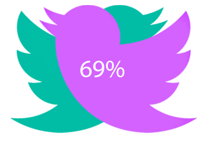

<!-- PROJECT LOGO -->

<br />
<p align="center">
  <a href="https://github.com/saydus/twitter-overlap">
    
  </a>

  <h3 align="center">Twitter Overlap</h3>

  <p align="center">
    Efficient and reliable way to analyze overlaps in followers of different Twitter accounts. 
    <br />
    <br />
    <a href="https://github.com/saydus/twitter-overlap/issues">Report Bug</a>
    ·
    <a href="https://github.com/saydus/twitter-overlap/issues">Request Feature</a>
  </p>
</p>

---

 
The script uses [Tweepy](https://github.com/tweepy/tweepy). Read about approaches to take for different use cases [here](https://docs.google.com/presentation/d/1O3CEgcAUOC1-aQjZ77A3QbBT_meE4uO_xgbYJGdr9Ns/edit?usp=sharing).

## Sample Output:
```
Followers of Tesla analyzed: 1546400
Overlaps with elonmusk found: 1407224
```

## Getting Started
Install all dependencies from `requirements.txt`, using `pip3 install -r requirements.txt`. If you are having issues with an SSL certificate when trying to run the script, use `PYTHONHTTPSVERIFY=0 python3 fetchFollowers.py
` to start it. 

Set up a MongoDB Atlas database, and obtain the link for connecting to it. From the link, get the username and password, which you will insert to the `.env` as specified below.

Create a `.env` file in repo's root to include authentication keys for your Twitter Developer account and other useful environment variables in the following format:
```.env
CONSUMER_KEY=your_value
CONSUMER_SECRET=your_value
ACCESS_TOKEN=your_value
ACCESS_TOKEN_SECRET=your_value

FIRST_USER=your_value
SECOND_USER=your_value

MONGO_USER=your_value
MONGO_PASSWORD=your_value
```
For `second_user`, use username of an account with a smaller amount of followers. The reasoning is explained further.

Repo contains three different approaches to calculate overlaps. 
1. Fetching all follower IDs of both accounts to hashmaps, and tracking same entries.
    * Good for small accounts. Produces an accurate number as a result. 
    * Takes a lot to run on big accounts because of Twitter API's 15-minute cooldown period.
2. Fetching followers of one user (`second_user`) and seeing if any of them are subscribed to the other user (`first_user`). 
    * This is an optimal solution for accounts with very different number of following.
    * The solution relies on the fact that `second_user` has less subscribers when fetching all of its followers.
    * Still takes time because of Twitter cooldown for fetching subscibtions (or "friends" in Twitter API terms).
3. Web scraping from Twitter's front-end.
    * Does not use Tweepy or Twitter's API, which means no cool-downs (yay!).
    * You would need to provide your Twitter credentials to run it since Twitter requires you to be logged in to see followers.

4. Monte Carlo method.
    * For the second solution here, I included a cap of 1 million followers for the smaller account. This will allow for a reasonable amount of runtime for fetching followers.
    * After calculating the ratio of overlapping followers in a random sample, we estimate the following for the whole set of subscribers.
    * Based on probabilities, so very flexible. Results are close to accurate on big enough sample (1 million), but never produces the actual result. Hence, this is a good approach to get insight into what the overlap numbers will look like for users with truly big number of followers.


## Other important stuff
Running `fetchFollowers.py`, the script will populate a MongoDB Atlas collection called `followers`. `analyzeOverlaps.py` will iterate through the collection and add boolean fields `checked` and `followsOtherUser`. 

If you stopped the program while fetching the followers, you can just run `analyzeOverlaps.py`, which will get you the result for already fetched and cached followers. 

For a longer wait time, you can run `fetchFollowers.py` locally (because it usually takes much less time to execute) and `analyzeOverlaps.py` in the cloud.

For twitter accounts with relatively small number of followers (< 5 million), run `fetchFollowers.py` for both accounts. Then, run `compareFetchedFollowers.py`. 
